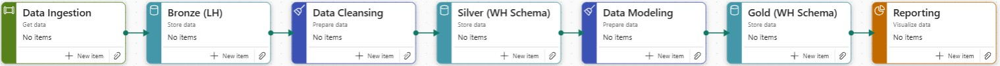
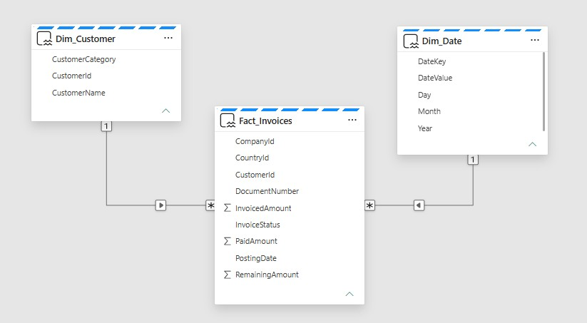
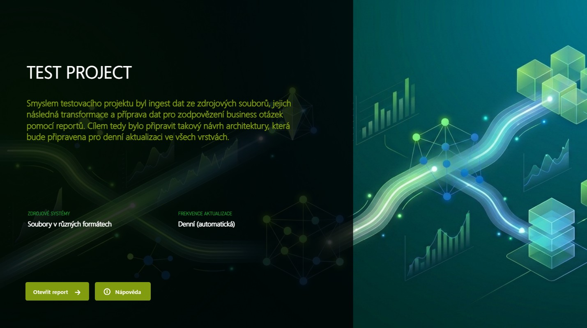
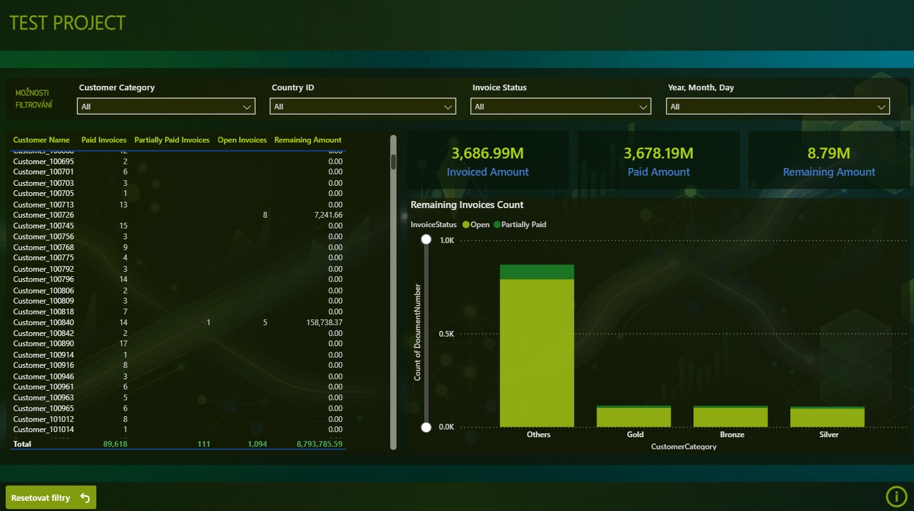
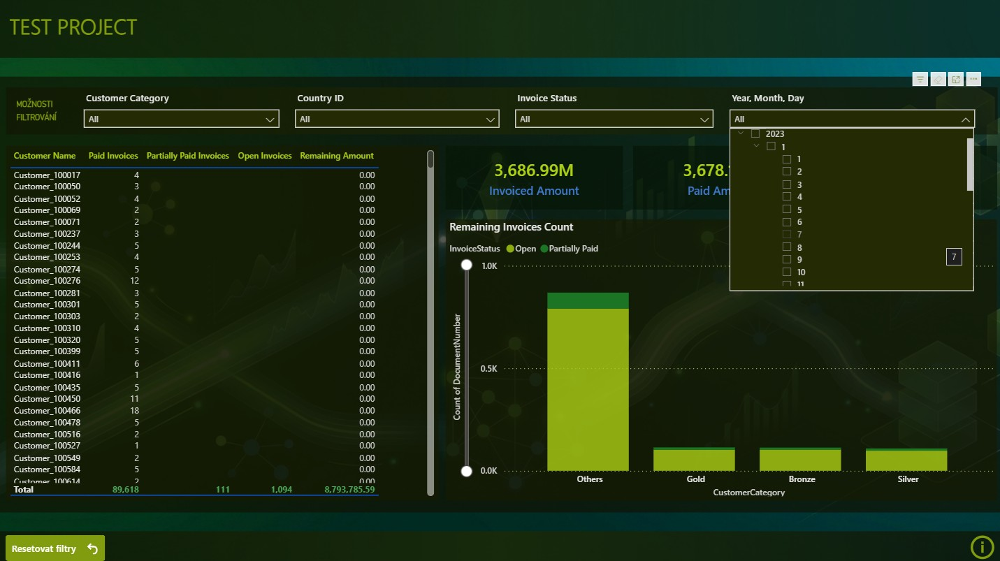

# EW - Test Project

### **Project Overview**
Smyslem testovacího projektu byl ingest dat ze zdrojových souborů, jejich následná transformace a příprava dat pro zodpovězení business otázek pomocí reportů. Cílem tedy bylo připravit takový návrh architektury, která bude připravena pro denní aktualizaci ve všech vrstvách. K celému procesu je vypracována stručná dokumentace.

---
### **Architecture Solution**
- Technologická platforma: MS Fabric (reporting Power BI)
- Architektura: Medallion
- Zdroj dat: soubory v různých formátech (.txt, .xlsx, .csv)

| Layer | Description |
| ----------- | ----------- |
| BRONZE (raw) | Raw data ze zdrojových souborů, uložená bez transformací (struktura stejná jako na zdroji) |
| SILVER (cleansed) | Vyčištěná, opravená a transformovaná data z bronze vrstvy |
| GOLD (reporting) | Data připravená pro následných reporting - zodpovězení business otázek |

- Vzorový task flow:
  - Get data: nejprve je nutné provést ingest dat ze zdrojových systémů/souborů
  - Store data (BRONZE): data v neměnné struktuře nahrána do úložiště
  - Prepare data: prostor pro transformace/úpravy dat z bronze vrstvy
  - Store data (SILVER): data již v upravené struktuře nahrána do úložiště
  - Prepare data: příprava business-ready dat pro vizualizace
  - Store data (GOLD): data připravené přímo pro vizualizace, nahrána do úložiště
  - Visualize: reporting nad daty z gold vrstvy

- Shrnutí architektury: zdrojové soubory -> Bronze vrstva (Lakehouse) -> čištění a transformace dat -> Silver vrstva (Warehouse schema) -> transformace dat pro reporting -> Gold vrstva (Warehouse schema) -> Power BI)
- Historizace vzhledem k povaze projektu řešena nebyla, ačkoliv kdyby se jednalo o aktivní projekt, zvolila bych historizaci SCD2 v Silver vrstvě

#### **Orchestration**
SCREEN PIPELINY

---
### **Data Ingestion (BRONZE)**
- Ingest dat ze zdrojových systémů v různých formátech (.txt, .xlsx, .csv)
  -  DS1_Customers.txt
  -  DS2_Invoices.xlsx
  -  DS3_Payments.csv
- Úložiště: lakehouse (Bronze_LH)
- Pro ukázku práce s MS Fabric použit pro každý soubor jiný způsob ingestu (v praxi lepší méně způsobů pro snadnější údržbu)
- Data vždy načtena v originální podobě bez úprav a změn datových typů (v případě chybných záznamů tak nedojde k pádu pipeliny)

#### **Files Ingestion**
- Ingest Customers (dataflow):
  - Rozhraní dataflow vychází z klasického Power Query - vhodné řešení pro pracovníky, kteří chtějí no-code řešení a dobře znají prostředí Power Query (nicméně nevýhodou náročnost na spotřebu CU a méně možností)
- Ingest Invoices (pipeline - copy data activity):
  - Velmi jednoduché nastavení source/destination
- Ingest Payments (PySpark notebook):
  - Mnoho možností s využitím PySpark
    
---
### **Data Quality & Cleansing (SILVER)**
- Úložiště: warehouse (Silver-Gold_WH), schema Silver
- Vzhledem k malému množství tabulek vrstvy Silver a Gold odděleny pouze schematem
- Silver tabulky nejprve jednorázově vytvořeny
- Následně vytvořená procedura provede tranformaci dat

#### Transformation
- Tabulka Silver.Customers:
  - Tabulka obsahuje samé textové řetězce, tudíž nebyla prováděna změna datových typů
  - Provedena deduplikace (nalezeny duplicitní hodnoty ve zdrojovém souboru)
  - Textové řetězce pro jistotu ošetřeny funkci TRIM (případné chyby v textových souborech)
  - Sloupec CustomerCategory navíc převeden do stavu, že vždy první písmeno je velké a zbytek malé (lepší následná čitelnost - především v reportech)
- Tabulka Silver.Invoices:
  - Změna datových typů (převod pomocí TRY_CAST)
  - Provedena deduplikace (zde preventivně, ve zdrojovém souboru nenalezeny duplicity)
  - Textové řetězce pro jistotu ošetřeny funkci TRIM
- Tabulka Silver.Payments:
  - Změna datových typů (převod pomocí TRY_CAST)
  - Vzhledem k tomu, že jedna má i více plateb a současně jedna platba se může vztahovat i k více fakturám (vazba M:N), vytvořila jsem surrogate klíč jako unikátní identifikátor záznamu - hashing
  - Provedena deduplikace (zde preventivně pomocí SK, ve zdrojovém souboru nenalezeny duplicity)
- U všech tabulek použit MERGE, který bere ohled i na soft deletes (přidán sloupec IsActive) - zde spíše preventivně vzhledem k povaze projektu (jelikož není plánován opakovaný load)
  
---
### **Reporting (GOLD)**
- Úložiště: warehouse (Silver-Gold_WH), schema Gold
- Vzhledem k malému množství tabulek vrstvy Silver a Gold odděleny pouze schematem
- Pro reporting využito klasické star schema
- Data připravena do klasického sémantického modelu v rámci MS Fabric pro následný reporting pomocí Power BI

#### Star Schema Tables
- Tabulka Dim_Date:
  - Vygenerovaná kalendářní tabulka s definovaným začátkem a koncem (pro tento případ, kdy PostingDate u tabulky Invoices obsahuje pouze leden z roku 2023, vygenerovaná data pouze pro tento rok a měsíc)
- Tabulka Dim_Customer:
  - Tabulka obsahuje všechny IsActive hodnoty ze Silver tabulky Customers
- Tabulka Fact_Invoices:
  - Tabulka obsahuje všechny IsActive hodnoty ze Silver tabulky Invoices
  - K těmto hodnotám připojeny agregované hodnoty plateb (ze Silver tabulky Payments) - agregováno podle InvoiceNumber
  - Ke každé faktuře vypočteno, jaká částka v rámci faktury je již uhrazena a jaká částka zbývá uhradit - na základě toho určen status celé faktury
    - Paid = plně uhrazená faktura
    - Partially Paid = částečně uhrazená faktura
    - Open = neuhrazená faktura

#### Gold Semantic model
- Pomocí vytvořeného star schematu vytvořen sémantický model a nastaveny relace pro Power BI report

#### Power BI report
- Data připojeny pomocí Direct lake (live connection)

